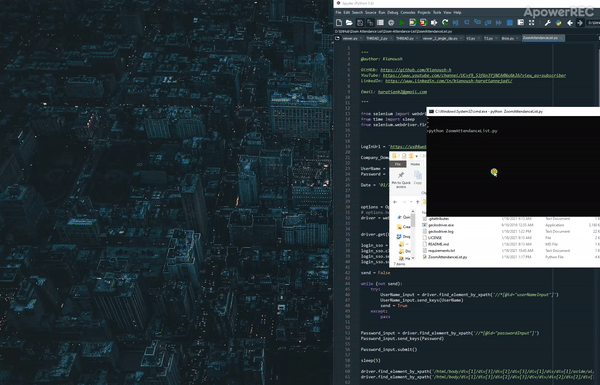

# Zoom Attendance List
 You can use this project to create the attendance list automaticaly without calling the students names and wait until theu answer. Your username, password and the meeting date are the only things that this code requires from the user to create the attendance list automaticaly.





## Install

### Dependencies

It would help if you had the following dependencies:

- python3
- selenium


### Install the repo and the requirements

Clone the repository and install 3rd-party libraries.

```bash
$ git clone https://github.com/Kianoush-h/Zoom-Attendance-List.git
$ cd Zoom-Attendance-List
$ pip3 install -r requirements.txt
```


## Run the code

You can run the code with this:

```
python3 ZoomAttendanceList.py
```
After you run the mentioned code in your console, it opens a browser page ( if you do not want to see the brwoser you can change the code to run the process in the background) and after 10 seconds it shows the attendance list automaticaly.

 
 

### Code Explanations

You can enter the Username and the Password in the first part of the code:

```
LogInUrl = 'https://us04web.zoom.us/web/sso/login?en=signin'

Company_Domain = 'concordia-ca'

UserName = 'concordia.ca\K_HARATI'
Password = '....'

Date = '01/10/2021' # mm/dd/yy
```


This part is related to the browser visibility:

```
options = Options()
# options.headless = True
driver = webdriver.Firefox(options=options, executable_path='./geckodriver.exe')
```

You need to enable the "options.headless" if you want to run the code in the background.


In the following example, we create a dictionary named switcher to store all the switch-like cases. We use the following part to find the month name to set it in the search section of the page.

```
def month_text(argument):
    switcher = {
        1: "January",
        2: "February",
        3: "March",
        4: "April",
        5: "May",
        6: "June",
        7: "July",
        8: "August",
        9: "September",
        10: "October",
        11: "November",
        12: "December"
    }
	return switcher.get(argument, "Invalid month")
```


Furthermore, The following part find the month number:

```
def month_int(argument):
    switcher = {
        "January": 1,
        "February": 2,
        "March": 3,
        "April": 4,
        "May": 5,
        "June": 6,
        "July": 7,
        "August": 8,
        "September": 9,
        "October": 10,
        "November": 11,
        "December": 12
    }
    # print (switcher.get(argument, "Invalid month"))
    return switcher.get(argument, "Invalid month")
```


 
 # Future 
 You can use this project to create the attendance list automaticaly 
 
Furthermore, I have a plan to modify this code to create different accounts in order to be able to like the video and subscribe to the channels.
 
 


# Contact Me

Email: haratiank2@gmail.com

YouTube channel: https://www.youtube.com/channel/UCvf9_53f6n3YjNEA4NxAkJA?view_as=subscriber

GitHub: https://github.com/Kianoush-h

LinkedIn: https://www.linkedin.com/in/kianoush-haratiannejadi/


